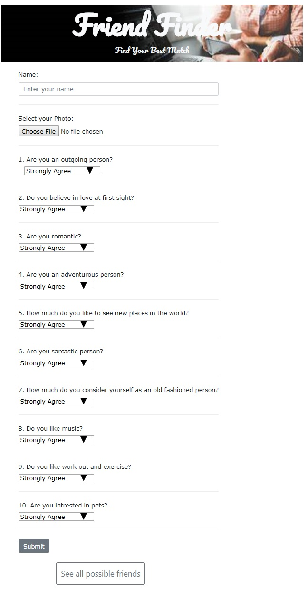
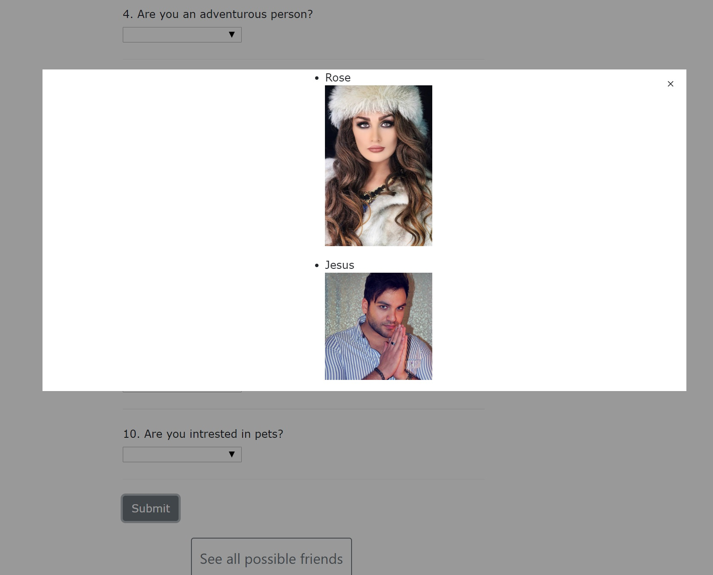

# FriendFinder

## Requirement
- Build a compatibility-based "FriendFinder" application -- basically a dating app.
- This full-stack site will take in results from your users' surveys, then compare their answers with those from other users.
- The app will then display the name and picture of the user with the best overall match. 

## Instructions
If you feel alone or need new people to meet, FriendFinder helps you to find friends that are matched with you.
You can see their name and picture after you fill out the survey. Also, you can see list of possible friends by clicking on the button at the bottom of page. 

You can see the live project through this link: [FriendFinder](https://aqueous-forest-95460.herokuapp.com/)

* You can see the picture of home page in the picture below. By clicking "Go to Survey" button, user can see the survey.

* You can click on the "See all possible friends " button to see the list of all possible mathches. You can see the screenshot of survey.html in the following picture:

Afer filling out all questions and clicking submit button, user can see the name and the picture of people who have the best match with user's interests. You can see the screen of showing all best matches in the picture below:

## Technologies Used
- Node.js
- Express.js NPM Package
- Body Parser NPM Package
- Path NPM Package
- Heroku

##Code Explanation
### Lesson Learned
- How to create a full stack application with Node.js and use Express.js.
- How to deply an application in Heroku.
- How to using routing in an application.

## Authors
- Sara Alinazari

